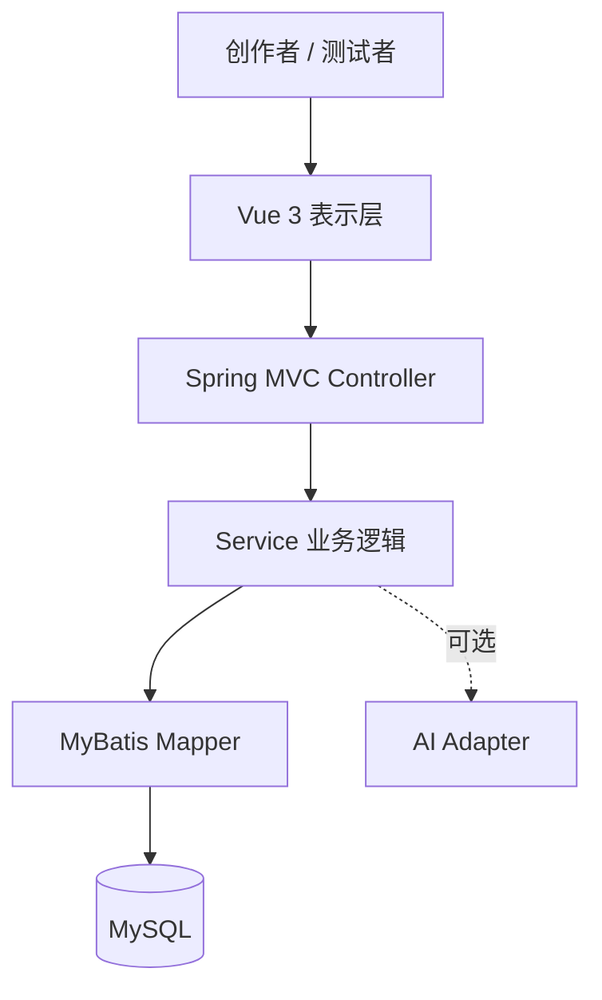
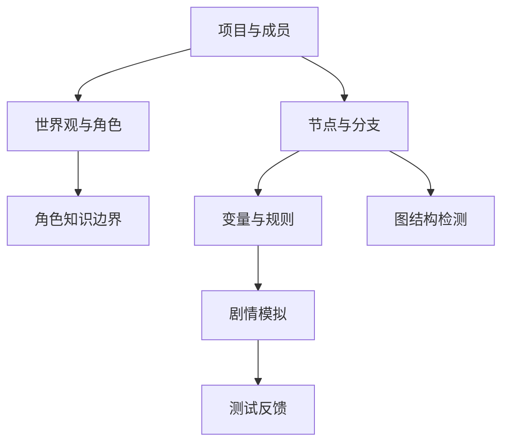

# 系统架构设计

## 1. 总体结构

AI Adapter 只能由业务服务调用，并需配置超时、失败降级和使用记录；确定性检测、编辑与模拟不得依赖它。

## 2. 后端分层职责

| 层 | 允许做什么 | 禁止做什么 |
|---|---|---|
| Controller | 参数接收、校验、当前用户提取、返回统一响应 | 直接写 SQL、拼装复杂业务、跳过 Service |
| Service | 事务、权限、状态机、规则和算法、业务异常 | 返回数据库内部细节、依赖前端状态保证安全 |
| Mapper | 单表 CRUD、明确的查询和批量操作 | 决定业务权限和状态流转 |
| Entity | 映射数据库字段 | 作为外部 API 请求体直接暴露 |
| DTO | 定义输入输出契约与校验 | 携带密码哈希等敏感字段 |

## 3. 核心模块依赖

项目模块是所有领域资源的安全边界。世界观和角色可独立于剧情图开发；节点稳定后，规则与图检测可以并行推进；模拟依赖节点和规则两者。

## 4. 数据模型原则

- 每个项目子资源均保存 `project_id`，便于权限过滤和级联清理。
- 数据库主键只用于内部关联；剧情导出使用项目内唯一的 `node_key`、`variable_key`。
- 条件与效果采用结构化行，不存可执行 JavaScript/SQL。
- `playtest_step.state_before/state_after` 使用 JSON 快照，保证问题可复现。
- 项目归档采用状态变化，不立即物理删除；子资源仍保留。
- 节点删除前必须检查是否被选择目标、测试记录引用。

## 5. 规则引擎边界

第一版支持三种变量：`BOOLEAN`、`INTEGER`、`STRING`。

| 类型 | 条件操作符 | 效果操作符 |
|---|---|---|
| BOOLEAN | EQ、NE | SET |
| INTEGER | EQ、NE、GT、GTE、LT、LTE | SET、ADD、SUBTRACT |
| STRING | EQ、NE | SET |

同一 `condition_group` 内条件按 AND 计算，不同组按 OR 计算。所有值先按照变量类型解析，失败返回 `RULE_VALUE_INVALID`，不得静默转换。

第3周实现细则：空条件集合表示无门槛；效果按照请求数组顺序写入 `sort_order` 并依次执行。同一变量可被多个效果连续修改。INTEGER 使用有符号64位整数，ADD/SUBTRACT 溢出返回400；BOOLEAN 仅接受小写 true/false；STRING 按大小写敏感的原文比较。

API 和快照中的变量值统一表示为字符串（例如 `{"trust":"50","hasKey":"true"}`），类型由变量定义指定，避免浏览器丢失64位整数精度。第0步记录起点初始快照；后续每步的 `node_id` 表示选择后到达的节点，`choice_id` 表示本次执行的选择。

变量定义在项目存在 RUNNING 会话时禁止修改。规则与剧情内容采用当前编辑版本；历史快照不重新计算。重新开始会保留旧会话和步骤，终止运行中的旧会话，并使用当前初始值创建新会话。本周不提供完整剧情版本快照。

## 6. 图检测算法

- 从唯一起点 BFS/DFS：得到可达节点集合。
- 入度为 0 且不是起点：缺少入口。
- 可达的非结局节点出度为 0：意外死路。
- DFS 三色标记或 Tarjan：检测循环；循环不一定是错误，应标为警告并允许忽略。
- 对带条件的边做“保守可达”分析；复杂条件的永不可满足检测放到后续版本。

## 7. 关键事务

- 创建项目与创建 OWNER 成员记录必须在同一事务。
- 执行剧情选择、写入步骤、更新会话当前节点必须在同一事务。
- 删除角色/变量前必须检查引用；失败时整个操作回滚。
- 运行检测时先清理或关闭上次同类 OPEN 问题，再批量写入本次结果。

第3周状态、规则和会话写操作使用项目行 `SELECT ... FOR UPDATE` 互斥；必须先取得锁，再建立一致性读快照。执行选择还必须匹配客户端 `expectedStepNo`，避免并发重复提交在自环分支上重复生效。步骤插入、会话更新与响应组装处于同一事务，任一步失败整体回滚。
